<!-- Saturated Animated Header Banner -->

<!-- Typing Text Header -->

 

<!-- Badges Row -->

  
  
  
  

  
  

---
### 💻 Terminal

<b>Specs</b>

 

  

---

### 🏢 Organization

<b>Organization: Palka Community</b>

 

  <table border="0">
    <tr>
      <!-- Left side: Badge / Logo -->
      <td width="90" align="center" valign="middle">
        
      </td>
      <!-- Right side: Title, Description, Repos, Members -->
      <td align="left" valign="middle">
        <h3 style="margin: 0;"><a href="https://github.com/Palka-Community" target="_blank">Palka Community</a></h3>
        
<i>палка комунити типот сакс</i>

        

          
          
          &nbsp;&nbsp;
          
          
          
          
          
          
        

      </td>
    </tr>
  </table>

---

### 🛰️ Featured Projects

| Project | Stack | Description | Status |
| :--- | :--- | :--- | :---: |
| [⚡ **VSTOS**](https://github.com/ValentinStars/VSTOS) | `C++` `x86 ASM` `Grub` | Custom bare-metal operating system built from scratch |  |
| [📱 **odin4.1**](https://github.com/ValentinStars/odin_gui_linux) | `Python` `Qt / GUI` | Linux GUI utility for flashing Samsung devices via Odin |  |
| [🔒 **VSTChat**](https://github.com/ValentinStars/VSTChat) | `C++` `Crypto` `CLI` | Terminal social network focused on end-to-end encryption |  |
| [🐧 **ESP-NIX**](https://github.com/ValentinStars/ESP-NIX) | `ESP8266` `Embedded OS` | Unix-like operating system running directly on ESP8266 |  |
| [💾 **ESPFlash**](https://github.com/ValentinStars/ESPFlash) | `C++` `ESP32-S3` | Native USB Mass Storage drive emulation from ESP32-S3 |  |
| [💣 **ardubomb**](https://github.com/ValentinStars/ardubomb) | `C++` `Arduino` | Interactive countdown timer and defusal simulator firmware |  |
| [🕒 **CyberClock**](https://github.com/ValentinStars/CyberClock) | `C++` `ESP8266` | Aesthetic ESP8266 table clock with web interface and sync |  |

---

### 🛠️ Experience & Stack

<b>Stack</b>

 

<table>
  <tr>
    <td width="25%" align="center"><b>Low-Level & Kernel</b></td>
    <td>
      
      
      
      
      
      
      
      
    </td>
  </tr>
  <tr>
    <td width="25%" align="center"><b>Hardware & Embedded</b></td>
    <td>
      
      
      
      
      
      
    </td>
  </tr>
  <tr>
    <td width="25%" align="center"><b>Cybersec & Analysis</b></td>
    <td>
      
      
      
      
      
    </td>
  </tr>
  <tr>
    <td width="25%" align="center"><b>Languages & Tooling</b></td>
    <td>
      
      
      
      
      
    </td>
  </tr>
</table>

---

### 📊 Telemetry

  <table border="0">
    <tr>
      <td width="50%" align="center">
        
      </td>
      <td width="50%" align="center">
        
      </td>
    </tr>
    <tr>
      <td width="50%" align="center">
        
      </td>
      <td width="50%" align="center">
        
      </td>
    </tr>
  </table>

  

---

### 🐍 Contributions

  

---

> *"It is better to be a humming noise in bundles and packages than a frozen silence among those who call themselves a crowd..."*
 
Breaking things since day one. Fixing them when curiosity demands it.

 

<!-- Saturated Animated Footer Banner -->

