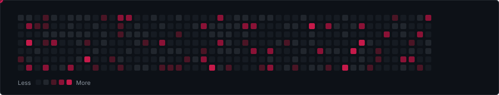

<div align="center">

<!-- Header Banner -->


<!-- Animated Terminal Typing Header -->
<a href="https://git.io/typing-svg">
  
</a>

<br/>

<!-- Status and Quick Links Badges -->
<p align="center">
  <a href="https://github.com/Palka-Community" target="_blank">
    
  </a>
  <a href="mailto:palkacommunity@national.shitposting.agency">
    
  </a>
  <a href="https://t.me/VSTBio" target="_blank">
    
  </a>
  <a href="https://vst.m1nercloud.ru" target="_blank">
    
  </a>
</p>

<p align="center">
  
  
  
</p>

</div>

---

### 💻 `systemctl status valentin.service`

<details open>
<summary><b>⚡ [ TERMINAL_HUD // LIVE_SYSTEM_TELEMETRY.LOG ] (Click to collapse)</b></summary>
<br/>

```ansi
┌──(root㉿valentin-node)-[/dev/firmware]
└─# neofetch --vst-mode

       /\_/\           OS: VSTOS (Custom x86_64 / ASM / Grub Bare-Metal)
      ( o.o )          Host: M5Stack CardputerADV / ESP32-S3 / Linux Rig
       > ^ <           Kernel: 6.x-vst-hardened-arm-x86
                       Uptime: 24/7 in the dark side 🍪
                       Shell: zsh + custom byte-level hotfixes
                       Org: Palka-Community (палка комунити типот сакс)
                       Weaponry: Ghidra, GDB, PlatformIO, Wireshark, ESP-IDF
                       Doctrine: "Tear into the guts, break it, rebuild from wreckage."
                       Warning: Do NOT touch the live microcontroller wires ⚡
```

</details>

---

### 🛰️ Featured Hardware & Offensive Tech Vault

| Project | Architecture & Stack | Description / Payload | Status |
| :--- | :--- | :--- | :---: |
| [🔥 **MarauderADV**](https://github.com/ValentinStars/MarauderADV) | `ESP32` `C++` `Cardputer` | ESP32 Marauder ported to CardputerADV with hotfixes |  |
| [⚡ **VSTOS**](https://github.com/ValentinStars/VSTOS) | `C++` `x86 ASM` `Grub` | Custom operating system written from bare metal |  |
| [👾 **Bruce**](https://github.com/ValentinStars/Bruce) | `C` `ESP32` `Firmware` | Predatory multi-tool firmware for ESP32 devices |  |
| [🔒 **VSTChat**](https://github.com/ValentinStars/VSTChat) | `C++` `Crypto` `CLI` | E2E encrypted anonymous terminal social mesh |  |
| [🐧 **ESP-NIX**](https://github.com/ValentinStars/ESP-NIX) | `ESP8266` `Embedded OS` | Linux-like operating system running on ESP8266 |  |
| [💣 **ardubomb**](https://github.com/ValentinStars/ardubomb) | `C++` `Arduino` | Tactical countdown & defusal simulation firmware |  |
| [🕒 **CyberClock**](https://github.com/ValentinStars/CyberClock) | `C++` `ESP8266` | Cyberpunk table clock firmware with web sync |  |
| [💾 **ESPFlash**](https://github.com/ValentinStars/ESPFlash) | `C++` `ESP32-S3` | Native USB mass-storage drive emulator from ESP32-S3 |  |

---

### 🛠️ The Arsenal & Hardware Lab

<details open>
<summary><b>⚙️ [ TECH_MATRIX // LOADOUT ] (Click to toggle)</b></summary>
<br/>

<table>
  <tr>
    <td width="25%" align="center"><b>Low-Level & Kernel</b></td>
    <td>
      
      
      
      
      
      
      
      
    </td>
  </tr>
  <tr>
    <td width="25%" align="center"><b>Hardware & Silicon</b></td>
    <td>
      
      
      
      
      
      
      
    </td>
  </tr>
  <tr>
    <td width="25%" align="center"><b>Cybersec & Binary Analysis</b></td>
    <td>
      
      
      
      
      
      
    </td>
  </tr>
  <tr>
    <td width="25%" align="center"><b>Scripting & Tooling</b></td>
    <td>
      
      
      
      
      
      
    </td>
  </tr>
</table>

</details>

---

### 🕹️ Interactive Easter Egg & Secret Chamber

<details>
<summary><b>🍪 [ SECRET_VAULT // DARK_SIDE_COOKIES.BIN ] (Click to unlock)</b></summary>
<br/>

```text
  .---.                                    .---.
 /   / \                                  / \   \
|   |   |    DARK SIDE COOKIE VAULT       |   |   |
 \   \ /                                  \ /   /
  '---'   STATUS: LEVEL 0x1337 UNLOCKED    '---'

  [+] Transmitting Cookie: 🍪 [SHITPOSTING_GRADE_FRESH]
  [+] Organization: Palka-Community
  [+] Secret Flag: FLAG{p4lk4_c0mmun1ty_b3st_firmw4r3_2026}

  Want to contact the operator? 
  -> Mail: palkacommunity@national.shitposting.agency
  -> Telegram: @VSTBio
```

</details>

---

### 📊 Live System Activity & Telemetry

<div align="center">
  <table border="0">
    <tr>
      <td width="50%" align="center">
        
      </td>
      <td width="50%" align="center">
        
      </td>
    </tr>
    <tr>
      <td width="50%" align="center">
        
      </td>
      <td width="50%" align="center">
        
      </td>
    </tr>
  </table>
</div>

<div align="center">
  
</div>

---

### 🐍 Contribution Grid Marauder

<div align="center">
  
</div>

---

### 📻 Cyberdeck Sound System

<div align="center">

```ansi
  ╔══════════════════════════════════════════════════════════════════╗
  ║  [▶ PLAYING]  Mick Gordon - The Only Thing They Fear Is You      ║
  ║  02:47  ━━━━━━━━━━━━━━━━━━━━●──────────────  04:15                  ║
  ║  [⇄ REPEAT]  [⚡ 1337 kbps FLAC]  [DSP: HARDWARE_OVERDRIVE]       ║
  ╚══════════════════════════════════════════════════════════════════╝
```

</div>

---

<div align="center">

> *"It is better to be a humming noise in bundles and packages than a frozen silence among those who call themselves a crowd..."*
<br/>
<sub>Breaking things since day one. Fixing them when curiosity demands it.</sub>

<br/>

<!-- Footer Banner -->


</div>
